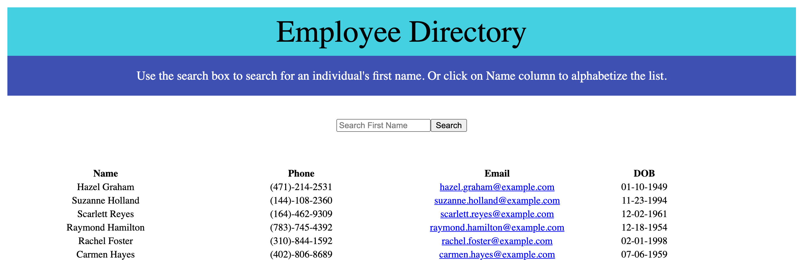

# Overview

For this assignment is an employee directory with React. An employee or manager would benefit greatly from being able to view non-sensitive data about other employees. It would be particularly helpful to be able to filter employees by name. the user should be able to sort the table by at least one category and filter the users by at least one property. Data is currently pulling from a generated employee list API.

# UserStory
As a user, I want to be able to view my entire employee directory at once so that I have quick access to their information.

# ScreenShot

# Links